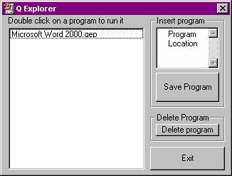



## Q Explorer \- open programs faster

### Description

You will be able to insert your programs into this program and put this program into the Start Up folder. The next time you start your computer this program will open and you will just have to double click on a program in th list and it will open.
 
### More Info
 
You will only be able to put .exe programs into the list. If any problems accure please e-mail me to qamar256@hotmail.com.

             |
---                |---
**Submitted On**   |2000-12-18 20:56:24
**By**             |[N/A](https://github.com/Planet-Source-Code/PSCIndex/blob/master/ByAuthor/empty.md)
**Level**          |Beginner
**User Rating**    |3.4 (17 globes from 5 users)
**Compatibility**  |VB 6\.0
**Category**       |[Coding Standards](https://github.com/Planet-Source-Code/PSCIndex/blob/master/ByCategory/coding-standards__1-43.md)
**World**          |[Visual Basic](https://github.com/Planet-Source-Code/PSCIndex/blob/master/ByWorld/visual-basic.md)
**Archive File**   |[CODE\_UPLOAD1281212182000\.zip](https://github.com/Planet-Source-Code/q-explorer-open-programs-faster__1-13685/archive/master.zip)

